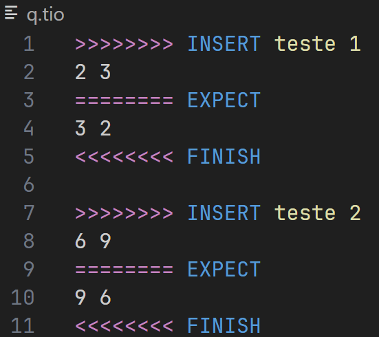

# Test In and Out (TIO) Syntax Highlighting

## Description

TIO is a custom file type made for using along with TKO, that contains tests that gets evaluated.

### Disclaimer

TKO and TIO are property of David Sena de Oliveira, from Universidade Federal do Ceará - Quixadá;
This extension was made by one of his students, Rodrigo Farinon.

[David Sena GitHub](github.com/senapk)
[Rodrigo Farinon GitHub](github.com/rodriggrr)
